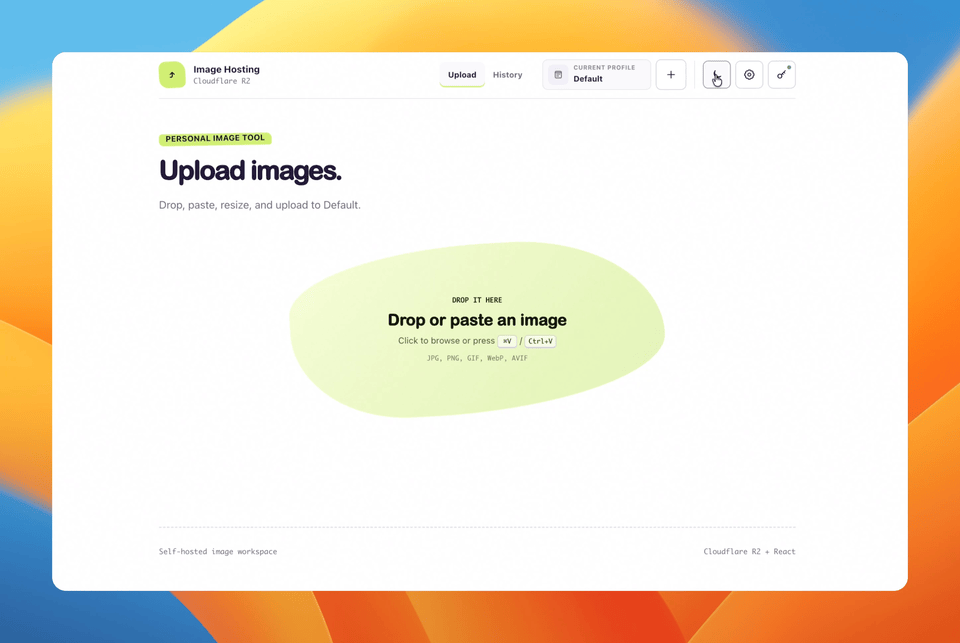

[English](README.md) | [繁體中文](README.zh-TW.md)

# R2 Image Hosting

一個適合部落格、技術文件與 Markdown 文章使用的小型自架圖片託管工具（圖床）

<p>
  
  
</p>

<p align="center">
  
</p>

- [R2 Image Hosting](#r2-image-hosting)
  - [Features](#features)
  - [Tech Stack](#tech-stack)
  - [Supported Images](#supported-images)
  - [Run Locally](#run-locally)
  - [Configuration](#configuration)
  - [Profiles](#profiles)
  - [API](#api)
  - [Security and Privacy](#security-and-privacy)
  - [Commands](#commands)
  - [Deploy](#deploy)
  - [License](#license)

可自行 clone 到本機或 deploy 至雲端，將圖片拖曳或貼到頁面，在瀏覽器中提供選項 resize、圖片壓縮、優化成 webp 後上傳至 Cloudflare R2，可複製 Markdown 圖片語法或網址

## Features

- **React & TypeScript：** 前端由 React & TypeScript 構成
- **上傳：** 拖曳單一檔案，或使用 `Command + V`／`Ctrl + V` 貼上圖片
- **預覽：** 上傳前先確認圖片
- **處理確認：** 比較尺寸、檔案大小、縮放比例與節省空間，再選擇原圖或處理後圖片
- **自訂處理：** 可使用原圖、1920px／85%、1280px／82%，或自訂長邊與 WebP 品質
- **自動命名：** 輸入顯示檔名，或產生八字元隨機名稱
- **上傳結果：** 上傳成功後顯示圖片、Markdown 與圖片網址
- **Profiles：** 切換不同 R2 bucket，並透過介面產生新的伺服器端 profile 設定
- **固定管理金鑰：** 使用部署者管理的 Bearer token 保護所有管理 API
- **主題：** 跟隨系統，或選擇亮色／深色模式
- **設定轉移：** 將介面與圖片處理偏好匯出或匯入為 JSON
- **標籤：** 新增標籤，並依標籤搜尋圖片
- **編輯：** 修改顯示檔名，不改變圖片網址
- **刪除：** 從圖片庫刪除圖片

## Tech Stack

| 技術 | 用途 |
| --- | --- |
| Cloudflare Workers | 提供網站與圖片 API |
| Cloudflare R2 | 儲存上傳圖片 |
| TypeScript | Worker 與 API 程式碼 |
| React、TypeScript、Vite | 瀏覽器介面 |
| Vitest | 自動化測試 |

瀏覽器端執行依賴為 React 與 ReactDOM；圖片處理使用瀏覽器原生 API

## Supported Images

支援 JPEG、PNG、GIF、WebP 與 AVIF，預設上傳上限為 10 MiB

伺服器會檢查實際檔案特徵，不只信任瀏覽器提供的 MIME type。由於 SVG 可能包含可執行腳本，因此不支援 SVG

## Run Locally

需要 Node.js 22 以上版本，推薦使用 nvm 管理版本

```bash
npm install
cp .dev.vars.example .dev.vars
openssl rand -hex 32
cp wrangler.jsonc.example wrangler.jsonc
```

將產生的值填入 `.dev.vars` 的 `ADMIN_TOKEN`，再啟動專案：

```bash
npm run dev
```

在瀏覽器開啟 [http://127.0.0.1:5173](http://127.0.0.1:5173)。Vite 會將 API 與圖片請求代理到 `8787` port 的本機 Worker

開發期間 Wrangler 使用本機 R2 儲存空間，因此本機上傳不會改動正式環境的 bucket

## Configuration

本機設定放在 `.dev.vars`：

```dotenv
ADMIN_TOKEN=replace-with-your-generated-value  // API Bearer token
CORS_ORIGINS=http://localhost:3000,https://www.example.com  // 限制可呼叫來源
MAX_UPLOAD_BYTES=10485760  // 上傳大小上限
```

Profile 名稱、binding 與公開網址統一在 `wrangler.jsonc` 的 `vars.IMAGE_PROFILES` 中管理。

第一次開啟網站時，系統會自動顯示管理金鑰視窗。輸入相同的 `ADMIN_TOKEN`，驗證後會儲存在該瀏覽器的 `localStorage`，直到你從金鑰圖示清除，或清除網站資料。匯出設定時不會包含管理金鑰。

正式環境請將金鑰存為加密的 Worker secret，不要放在 Wrangler 變數中：

```bash
npx wrangler secret put ADMIN_TOKEN
```

## Profiles

每個 profile 對應一個 Cloudflare R2 bucket。切換 profile 後，上傳、歷史紀錄、搜尋與刪除都會依 bucket 分開

1. 在 Cloudflare 建立 R2 bucket，並啟用公開網址。
2. 在應用程式中選擇 **+**，填寫下列表格欄位。
3. 複製 **R2 bucket binding**，直接貼到 `wrangler.jsonc` 的 `r2_buckets` 陣列中。
4. 複製 **Profile entry**，直接貼到 `vars.IMAGE_PROFILES` 陣列中。
5. 本機測試時重新啟動 Worker；正式環境執行 `npm run deploy`，再重新整理應用程式。

| 欄位 | 必填 | 填寫內容 | 範例 |
| --- | --- | --- | --- |
| **Profile name** | 是 | 顯示在 profile 切換選單中的名稱，最多 60 個字元。 | `Archive` |
| **Profile ID** | 是 | 1–32 個小寫字母、數字或連字號組成的固定 ID。 | `archive` |
| **R2 bucket name** | 是 | Cloudflare **R2 object storage → Overview** 顯示的完整 bucket 名稱。 | `archive-images` |
| **Worker binding** | 是 | Worker 使用的唯一 JavaScript 變數名稱，建議使用大寫字母與底線。 | `ARCHIVE_IMAGES` |
| **Public image URL** | 是 | **Bucket → Settings → Public access** 中已啟用的網址，不加結尾斜線。 | `https://archive-img.example.com` |

預設 profile 保留 `"id": "default"`。兩個複製欄位都已包含尾逗號，可直接貼入對應陣列；`r2_buckets` 與 `IMAGE_PROFILES` 的 binding 名稱必須完全一致。

## API

| 方法 | 路徑 | 用途 |
| --- | --- | --- |
| `GET` | `/health` | 檢查 Worker 是否正常運作 |
| `GET` | `/api/auth/verify` | 驗證已儲存的管理金鑰 |
| `GET` | `/api/profiles` | 列出安全的 profile ID 與名稱 |
| `GET` | `/images/:key` | 取得圖片 |
| `GET` | `/profile-images/:profile/:key` | 從其他 profile 取得圖片 |
| `POST` | `/api/images?profile=...` | 上傳圖片 |
| `GET` | `/api/images?profile=...` | 列出圖片並依標籤篩選 |
| `PATCH` | `/api/images?profile=...&key=...` | 更新顯示檔名或標籤 |
| `DELETE` | `/api/images?profile=...&key=...` | 刪除圖片 |

`profile` query 可省略；省略時使用預設 profile。

所有 `/api/*` 路徑都需要 `Authorization: Bearer <ADMIN_TOKEN>`。`/images/*` 與 `/profile-images/*` 公開圖片路徑不需要驗證。

## Security and Privacy

- 上傳圖片是公開的。隨機圖片 ID 可降低意外被發現的機率，但不是存取控制。
- 使用只允許此 Worker 寫入的專用 R2 bucket。公開圖片回應會拒絕非圖片 Content-Type。
- 管理金鑰會儲存在目前瀏覽器的 `localStorage`。請使用可信任的瀏覽器 profile；若可能外洩，請更換 Worker secret。
- 不要提交 `.dev.vars`、`.env`、`wrangler.jsonc` 或 `.wrangler/`。`.wrangler/` 可能包含本機 R2 物件與 metadata。
- 請透過 Git 分享專案，不要直接壓縮整個工作目錄，避免包含已忽略的本機檔案。

## Commands

| 指令 | 用途 |
| --- | --- |
| `npm run dev` | 啟動 Vite 與本機 Worker |
| `npm run dev:worker` | 只啟動本機 Worker |
| `npm run build` | 建置 React 正式環境資源 |
| `npm test` | 執行測試 |
| `npm run lint` | 檢查程式碼格式與規則 |
| `npm run typecheck` | 檢查 TypeScript 型別 |
| `npm run check` | 執行 lint、型別檢查、測試與正式建置 |
| `npm run deploy` | 部署 Worker 至 Cloudflare |

## Deploy

1. 登入 Cloudflare 並建立 R2 bucket：

   ```bash
   npx wrangler login
   npx wrangler r2 bucket create my-images
   ```

2. 如果尚未建立本機部署設定，先複製公開範例：

   ```bash
   cp wrangler.jsonc.example wrangler.jsonc
   ```

   接著修改 `wrangler.jsonc` 中的 placeholder：

   - `name`
   - `r2_buckets[0].bucket_name`
   - `vars.IMAGE_PROFILES[0].label`
   - `vars.IMAGE_PROFILES[0].publicBaseUrl`
   - 若其他瀏覽器來源需要呼叫 API，修改 `vars.CORS_ORIGINS`

3. 為 bucket 連接自訂網域，或啟用 `r2.dev` 網址，再將該網址填入 profile 的 `publicBaseUrl`。

4. 第一次部署時，產生正式環境的管理金鑰並存為 Worker secret：

   ```bash
   openssl rand -hex 32
   npx wrangler secret put ADMIN_TOKEN
   ```

5. 部署：

   ```bash
   npm run deploy
   ```

只有在 `secrets.required` 中宣告 secret 時，Wrangler 才會在部署時強制檢查。此範例未啟用該選用驗證，以相容仍使用舊 `AUTH_TOKEN` 的部署。新部署只需設定一次 `ADMIN_TOKEN`；Cloudflare 會在後續 `wrangler deploy` 時保留 secret，只有更換或重新建立時需要再次輸入。若兩種 token 都沒有設定，Worker 仍可部署，但管理 API 會回傳 `AUTH_NOT_CONFIGURED`。詳情請參考 Cloudflare 的 [Secrets 文件](https://developers.cloudflare.com/workers/configuration/secrets/)。

## License

MIT。請參考 [LICENSE](LICENSE)。
